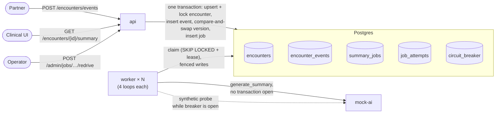
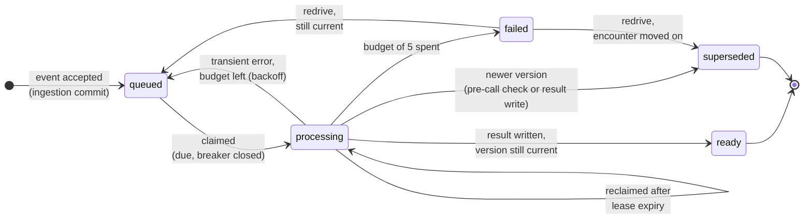

# Reliable Encounter Updates & AI Summaries

> **Evaluating this? Start with [docs/REVIEW_GUIDE.md](docs/REVIEW_GUIDE.md).** Each failure scenario from the brief runs as one command, with the output to expect and what it proves.

A backend service that receives clinical encounter updates from a partner system, stores the latest version of each encounter, and generates an AI summary of it in the background.

This is the working implementation of the design I submitted for the Backend Engineer / Clinical AI exercise. The full design is in [`docs/design.md`](docs/design.md), and every place the code interprets or departs from it is recorded in [`DECISIONS.md`](DECISIONS.md). The exercise brief was provided privately, so it isn't included here.

## The problem

Both sides of the service are unreliable. The partner sends the same update twice, sends versions out of order, and sends them concurrently. The AI call is slow, sometimes fails, words its answer differently each time, and costs money on every attempt, including retries.

## What the service guarantees

- **Every accepted update is stored exactly once**, and the stored version never goes backwards.
- **No accepted update is lost**, even if a process crashes mid-request.
- **An older summary is never shown as current**, whatever order the AI calls finish in.
- **Conflicting data is rejected, never applied**: an update that changes an encounter's patient or rewrites an existing version gets a `409`.
- **An AI outage costs a bounded number of paid calls**, however many jobs are waiting.
- **No patient content reaches logs or metrics**: no transcripts, summaries, or raw provider errors.

The first three rest on Postgres itself: unique constraints decide duplicates, a compare-and-swap update stops regressions, and each accepted update and its summary job commit in one transaction. The outage bound comes from retry budgets and a circuit breaker shared across workers. Each guarantee has a test that forces the race, crash, or outage it protects against; [`docs/guarantees.md`](docs/guarantees.md) maps every one to its mechanism and test.

**Contents:** [5-minute tour](#5-minute-tour) · [Quick start](#quick-start) · [How it works](#how-it-works) · [API](#api) · [Tests](#tests) · [Departures from the design](#departures-from-the-design) · [Limitations](#known-limitations)<br>
**More:** [review guide](docs/REVIEW_GUIDE.md) · [guarantees and code map](docs/guarantees.md) · [operations](docs/operations.md) · [testing](docs/testing.md) · [decisions](DECISIONS.md)

## 5-minute tour

1. **Run it, break it, prove it:** the [review guide's 5-minute essentials](docs/REVIEW_GUIDE.md#1-before-you-start). Each scenario script triggers one of the brief's failures and prints the responses and stored state. Then run `make test` for the [seven headline tests](#tests).
2. **Read the core, in this order:**

   | File | What it holds | Design section |
   |---|---|---|
   | [`app/api/ingest.py`](app/api/ingest.py) | The single ingestion transaction | §3 |
   | [`app/worker/claim.py`](app/worker/claim.py) | Claiming: `SKIP LOCKED`, lease, fencing counter, reclaim | §5 |
   | [`app/worker/result.py`](app/worker/result.py) | Fenced result writes, retry budget, backoff | §5 |
   | [`app/worker/breaker.py`](app/worker/breaker.py) | Shared circuit breaker and its probe race | §5 |
   | [`tests/test_headline.py`](tests/test_headline.py) | The seven tests that prove the above | §7 |

## Quick start

Requires Docker with Compose v2; nothing else on the host. **All commands in this README and `docs/` are bash:** on Windows, run them in Git Bash or WSL, not PowerShell. **Stack:** Python 3.12 · FastAPI · Postgres 16 via psycopg 3 and raw SQL (no ORM) · Docker Compose.

```sh
git clone https://github.com/D-Dynamico/OutcomesAi.git && cd OutcomesAi
docker compose up --build -d --wait         # or: make up (waits until healthy)
curl localhost:8000/healthz                 # {"status":"ok"}
make test                                   # full suite against a real Postgres (~2 min)
scripts/scenario_late_version.sh            # one of the brief's failure scenarios, end to end
```

The schema is applied at startup under an advisory lock, so start order doesn't matter. Without `make` (for example on Windows), use the plain commands in [`docs/testing.md`](docs/testing.md#running) and the [`Makefile`](Makefile).

| Service | Role | Host port |
|---|---|---|
| `db` | Postgres 16. All state, including the job queue and the circuit breaker row. | none |
| `api` | FastAPI: ingestion, reads, admin redrive, `/healthz`, `/metrics`. | 8000 |
| `worker` | Claims and summarises jobs, 4 loops per process; scales with `--scale worker=N`. Metrics on internal port 9100. | none |
| `mock-ai` | The mock `generate_summary` provider: latency, failures, an outage switch, real/probe call counts. Never logs request bodies. | 8001 |

## How it works



1. **Ingestion is one transaction.** After a size check (`413`) and validation (`400`), the encounter row is upserted and locked, identity is checked, the event is inserted so the constraints can decide duplicates, the version moves only by compare-and-swap, and the job row is inserted. Every outcome but accepted rolls back. The commit *is* the hand-off to the workers, so nothing can be saved without its work.
2. **Workers claim from the table.** They use `FOR UPDATE SKIP LOCKED` and stamp a 60 s lease. The job's `attempts` column is bumped as a fencing counter, and an attempt row is committed **before** any paid call.
3. **The call runs outside any transaction.** Every later write is fenced on `attempts = my_attempt`, so a worker that stalled past its lease can't overwrite anything.
4. **Reads resolve through `encounters.current_version`.** No pointer to the "current job" is stored, so an older summary can't be reached once a newer version is accepted.
5. **One shared breaker row watches the provider.** It trips on 11 of the last 20 service-reaching attempts. While it's open, workers claim nothing, so no job's budget is touched, and a single worker sends a synthetic probe once per cooldown.

**A job's lifecycle.** `failed` is terminal for automation: only an operator's redrive moves it, which puts a human decision between an exhausted budget and further spend.



## API

The responses below are real output from this stack.

```sh
curl -i -X POST localhost:8000/encounters/events -H 'content-type: application/json' -d '{
  "event_id": "evt-102", "encounter_id": "enc-42", "patient_id": "pat-77",
  "encounter_type": "TelephoneTriage", "version": 12,
  "payload": {"transcription": "Nurse: Triage line, what is going on today? Patient: I have had a fever since last night and now my throat hurts."}}'
curl localhost:8000/encounters/enc-42/summary
```

| POST outcome | How to get it | Response |
|---|---|---|
| **Accepted** | the request above | `201`, `Location: /encounters/enc-42/summary`<br>`{"outcome":"accepted","encounter_id":"enc-42","version":12,"current_version":12,"job_status":"queued"}` |
| **Duplicate** | send it again, or a new `event_id` for the same version and transcript | `200` `{"outcome":"duplicate","encounter_id":"enc-42","version":12,"current_version":12}` |
| **Payload conflict** | same `event_id` or version, different transcript | `409` `{"outcome":"payload_conflict",…,"message":"A different payload is already recorded for this version."}` |
| **Identity conflict** | `"patient_id": "pat-99"` | `409` `{"outcome":"identity_conflict","encounter_id":"enc-42","current_version":12,"conflicting_field":"patient_id",…}`; neither patient ID is echoed |
| **Stale** | version 11 after 13 was accepted | `200` `{"outcome":"stale","encounter_id":"enc-42","version":11,"current_version":13}` |
| **Malformed** / **too large** | `"version": 0` / body over 1 MB | `400` `{"error":"invalid_request","detail":"version must be a positive integer"}` / `413` |

**GET.** Ready, after v13 superseded v12 at the pre-call check, with no paid call for v12:

```json
{"encounter_id":"enc-42","patient_id":"pat-77","encounter_type":"TelephoneTriage","current_version":13,"status":"ready","summary_version":13,"summary":"Summary prepared; clinician review recommended. Source length: 22 words. Ref 2.","accepted_at":"2026-09-28T13:18:03Z","completed_at":"2026-09-28T13:18:09Z","sla_breached":false}
```

Before that, GET reports `"status":"processing"` (queued jobs included). After exhausting the budget it reports `"status":"failed"` with `attempts` and `error_class`, and an unknown encounter returns `404`. `sla_breached` is computed at read time with Postgres `now()`.

**Redrive** a failed job:

```sh
curl -X POST localhost:8000/admin/jobs/1/redrive
# {"job_id":1,"outcome":"redriven"}                                still current: fresh budget of 5
# {"job_id":1,"outcome":"superseded","superseded_by_version":13}   encounter moved on: never paid for
```

`POST /admin/jobs/redrive` with `{"failed_from", "failed_to"}` does the same for every job that failed in a time window. For a full walkthrough, from a job failing to its redrive, see [scenario 7b in the review guide](docs/REVIEW_GUIDE.md#7b-retry-exhaustion-inspection-and-redrive).

## Tests

180 tests run against a real Postgres, never SQLite or a fake. The seven headline tests are in [`tests/test_headline.py`](tests/test_headline.py):

| # | Test | Proves |
|---|---|---|
| 1 | Concurrent duplicate, on existing and brand-new encounters (200 iterations each) | the `event_id` primary key decides duplicates; no shell row is left behind |
| 2 | v12 and v13 race in both orders (100 iterations), worker running, GET sampled throughout | the version never regresses; v12 is never shown once v13 is committed |
| 3 | Two first events for a new encounter with different patients (200 iterations) | the first patient wins, and the 409 has no patient IDs |
| 4 | The API process is killed before and after the ingestion COMMIT; the partner retries | no work is lost, and the summary is generated exactly once |
| 5 | Compressed outage: 100 jobs, 4 workers | real calls ≤ 11 + in-flight; probes synthetic and counted; no job fails; all recover |
| 6 | Results forced out of order (v13 returns before v12) | v12 ends `superseded_by_version: 13` and is never shown |
| 7 | A worker stalled past a real lease expiry | fenced: `lease_expired`, then `discarded`; the budget counts both calls |

The concurrency tests force the interleaving, not just hope for it. A barrier releases the requests, and a test-only hook holds the first transaction after it takes the row lock until Postgres shows the second one waiting. Each iteration asserts that happened. Crash tests kill a real uvicorn process at the named point with `os._exit`. All test hooks do nothing unless `TEST_HOOKS` is set. Per-file coverage and the harness are described in [`docs/testing.md`](docs/testing.md).

## Departures from the design

The ones that change behaviour; the reasoning for each is in [`DECISIONS.md`](DECISIONS.md):

- **D24:** the breaker check locks its row before counting; the design's plain count undercounted under concurrency (found by testing).
- **D2:** after recovery, only failures since the breaker last closed count.
- **D1:** a stalled worker's late result marks its attempt `discarded`.
- **D7:** a reused `event_id` is a duplicate only if encounter, version and content all match; otherwise `409`.
- **D21:** the 30 s AI timeout is a total deadline, not per read.
- **D23:** a crashing or stopping worker finishes its in-flight calls before exiting.

## Known limitations

From design §8, all still true of this implementation (its operational limits are in [`docs/operations.md`](docs/operations.md#limitations)):

- **No authentication or authorization:** any caller can post events, read summaries with patient linkage, and redrive jobs. And since the first patient wins, **a wrong first binding can't be corrected through the API.**
- **Every provider error is treated as transient,** so a permanently rejected input costs up to 5 calls; and **encounter-level starvation isn't detected** (versions arriving faster than summaries can be produced).
- **Summaries aren't validated** against their transcript, and **there is no retention or deletion policy** for transcripts and summaries.
