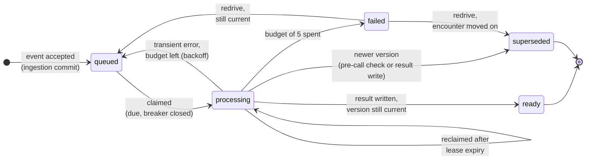

# Reliable Encounter Updates & AI Summaries

A backend service that receives clinical encounter updates from a partner system, stores the latest version of each encounter, and generates an AI summary of it in the background.

This is the working implementation of the design I submitted for the Backend Engineer / Clinical AI exercise. The full design is in [`docs/design.md`](docs/design.md), and every place the code interprets or departs from it is recorded in [`DECISIONS.md`](DECISIONS.md).

## The problem

Both sides of the service are unreliable. The partner sends the same update twice, sends versions out of order, and sends them concurrently. The AI call is slow, sometimes fails, words its answer differently each time, and costs money on every attempt, including retries.

## What the service guarantees

- **Every accepted update is stored exactly once**, and the stored version never goes backwards.
- **No accepted update is lost**, even if a process crashes mid-request.
- **An older summary is never shown as current**, whatever order the AI calls finish in.
- **Conflicting data is rejected, never applied**: an update that changes an encounter's patient or rewrites an existing version gets a `409`.
- **An AI outage costs a bounded number of paid calls**, however many jobs are waiting.
- **No patient content reaches logs or metrics**: no transcripts, summaries, or raw provider errors.

The first three rest on Postgres itself: unique constraints decide duplicates, a compare-and-swap update stops regressions, and each accepted update and its summary job commit in one transaction. The outage bound comes from retry budgets and a circuit breaker shared across workers. Each guarantee has a test that forces the race, crash, or outage it protects against.

## Try it

```bash
docker compose up --build   # api on :8000, plus worker, mock AI provider and Postgres
make test                   # full suite against a real Postgres
```

Examples for every API outcome, the outage demo and redrive are below.

**Stack:** Python 3.12 · FastAPI · Postgres 16 via psycopg 3 and raw SQL (no ORM) · Docker Compose (api, worker, mock-ai, db).

**Contents:** [5-minute tour](#5-minute-tour) · [Quick start](#quick-start) · [How it works](#how-it-works) · [Guarantees](#guarantees-and-where-they-are-proven) · [API](#api) · [Demo: AI outage](#demo-a-20-minute-ai-outage) · [Demo: failure and redrive](#demo-retry-exhaustion-and-redrive) · [Observability](#observability) · [Configuration](#configuration) · [Tests](#tests) · [Design to code](#design-to-code) · [Limitations](#known-limitations)

---

## 5-minute tour

1. **Run it:** `docker compose up --build`, then post an event and read it back. The first two commands in [API](#api) do this, and the summary is `ready` a few seconds later.
2. **Break the AI:** follow [Demo: AI outage](#demo-a-20-minute-ai-outage). The breaker trips after about 11 paid calls, probes once per cooldown, and every job recovers when the outage ends.
3. **Run the proofs:** `make test` runs 180 tests against real Postgres, including the [seven headline tests](#tests) that force the races and crashes the design is about.
4. **Read the core, in this order:**

   | File | What it holds | Design section |
   |---|---|---|
   | [`app/api/ingest.py`](app/api/ingest.py) | The single ingestion transaction | §3 |
   | [`app/worker/claim.py`](app/worker/claim.py) | Claiming: `SKIP LOCKED`, lease, fencing counter, reclaim | §5 |
   | [`app/worker/result.py`](app/worker/result.py) | Fenced result writes, retry budget, backoff | §5 |
   | [`app/worker/breaker.py`](app/worker/breaker.py) | Shared circuit breaker and its probe race | §5 |
   | [`tests/test_headline.py`](tests/test_headline.py) | The seven tests that prove the above | §7 |

5. **Check the judgement calls:** [`DECISIONS.md`](DECISIONS.md). D24 is the one that fixes a real concurrency bug in the design's SQL.

---

## Quick start

Requires Docker with Compose v2. Nothing else is needed on the host.

```sh
git clone https://github.com/D-Dynamico/OutcomesAi.git && cd OutcomesAi
docker compose up --build                   # or: make up (detached)
curl localhost:8000/healthz                 # {"status":"ok"}
docker compose up -d --scale worker=3       # workers scale horizontally
```

The schema is applied automatically at startup. The api and every worker replica apply it under an advisory lock, so start order doesn't matter (D11).

| Service | Role | Host port |
|---|---|---|
| `db` | Postgres 16. All state, including the job queue and the circuit breaker row. | none |
| `api` | FastAPI: ingestion, reads, admin redrive, `/healthz`, `/metrics`. | 8000 |
| `worker` | Claims and summarises jobs. Runs `WORKER_CONCURRENCY` loops (default 4) and serves metrics on internal port 9100. Scales with `--scale worker=N`. | none |
| `mock-ai` | The mock `generate_summary` provider: latency, failures, an outage switch, and real/probe call counts. Never logs request bodies (D3, D22). | 8001 |

`make up`, `make down`, `make logs` and `make test` wrap the plain `docker compose` commands shown in each section. Without `make` (for example on Windows), run those commands directly.

---

## How it works


1. **Ingestion is one transaction.** The encounter row is upserted and locked, the event is inserted so the constraints can decide duplicates, the version moves only by compare-and-swap, and the job row is inserted. The commit *is* the hand-off to the workers, so nothing can be saved without its work.
2. **Workers claim from the table.** They use `FOR UPDATE SKIP LOCKED` and stamp a 60 s lease. The job's `attempts` column is bumped as a fencing counter, and an attempt row is committed **before** any paid call.
3. **The call runs outside any transaction.** Every later write is fenced on `attempts = my_attempt`, so a worker that stalled past its lease can't overwrite anything.
4. **Reads resolve through `encounters.current_version`.** An older summary can't be reached once a newer version is accepted.
5. **One shared breaker row watches the provider.** It trips on 11 of the last 20 service-reaching attempts. While it's open, workers claim nothing, and a single worker sends a synthetic probe once per cooldown.

**A job's lifecycle:**



`failed` is terminal for automation. Only an operator's redrive moves it, which puts a human decision between an exhausted budget and further spend.

---

## Guarantees and where they are proven

Each row is one of CLAUDE.md's non-negotiables: the mechanism that enforces it, and the test that would fail without it.

| Guarantee | Enforced by | Proven by |
|---|---|---|
| Ingestion commits all of it or none of it | One transaction in `ingest()`: every outcome except accepted rolls back | headline test 4 (process killed before and after COMMIT) · `test_failure_before_commit_rolls_back_everything` |
| Duplicates are decided by constraints, never by a read first | `INSERT … ON CONFLICT DO NOTHING` on the `event_id` primary key and `(encounter_id, version)` | headline test 1 (200 forced races × 2) |
| The version never regresses | `UPDATE … WHERE current_version < :version` (compare-and-swap) | headline test 2 |
| First patient wins; the 409 echoes no patient ID | Identity read back under `FOR UPDATE` | headline test 3 |
| `generate_summary` never runs inside a transaction | Three short transactions around the call | `test_no_transaction_or_lock_held_during_the_call` (checks for open transactions and row locks mid-call) |
| Spend is recorded before it happens | The attempt row is committed at claim, and `probes_sent` is committed before the probe call | same test · headline test 5 (`probes_sent` = probe calls) |
| Every worker write is fenced | `attempts = :my_attempt` (and `status = 'processing'`) on every worker write, `probe_generation` on probe reports | headline test 7 · `test_stalled_prober_cannot_overwrite_a_newer_verdict` · `test_worker_from_before_the_failure_cannot_write_after_redrive` |
| An older summary never appears as current | GET joins through `current_version`, and the result write labels obsolete results `superseded` | headline tests 2 and 6 (GET sampled throughout) |
| An outage costs a bounded number of calls, whatever the queue depth | Shared breaker; trip check serialized by a row lock (D24) | headline test 5 · `test_breaker.py` |
| All time comparisons use Postgres `now()` | Leases, backoff, cooldowns and SLA are all computed in SQL | `test_processing_sla_breach_uses_database_clock` · headline test 7 (real lease expiry) |
| No patient content in logs, metrics or error bodies | Fixed-enum errors; the JSON log formatter reduces exceptions to their type | `test_logs_never_carry_patient_content` (a 500 whose exception message *is* the transcript) · `test_metrics_carry_no_patient_content` |
| Response bodies match design §4 exactly | Built in one place per outcome | exact-body tests in `test_ingest.py` and `test_read.py` |

---

## API

All examples below were run against this stack. The responses are pasted verbatim, with timestamps and summaries as they came back.

### POST `/encounters/events`: accept an update

Every request has the same shape:

```sh
curl -i -X POST localhost:8000/encounters/events -H 'content-type: application/json' -d '{
  "event_id": "evt-102", "encounter_id": "enc-42", "patient_id": "pat-77",
  "encounter_type": "TelephoneTriage", "version": 12,
  "payload": {"transcription": "Nurse: Triage line, what is going on today? Patient: I have had a fever since last night and now my throat hurts."}}'
```

| Outcome | How to get it | Response |
|---|---|---|
| **Accepted / current** | the request above | `201 Created`, `Location: /encounters/enc-42/summary`<br>`{"outcome":"accepted","encounter_id":"enc-42","version":12,"current_version":12,"job_status":"queued"}` |
| **Duplicate** (plain retry) | send it again | `200 OK`<br>`{"outcome":"duplicate","encounter_id":"enc-42","version":12,"current_version":12}` |
| **Duplicate** (source defect) | a new `event_id`, same version and transcript | `200 OK`, same body. Logged at WARNING and counted in `ingest_duplicate_source_defects_total` |
| **Payload conflict** | same `event_id`, different transcript | `409 Conflict`<br>`{"outcome":"payload_conflict","encounter_id":"enc-42","version":12,"current_version":12,"message":"A different payload is already recorded for this version."}` |
| **Identity conflict** | `"patient_id": "pat-99"`, version 14 | `409 Conflict`<br>`{"outcome":"identity_conflict","encounter_id":"enc-42","current_version":12,"conflicting_field":"patient_id","message":"Contradicts stored encounter identity. Retrying will not succeed."}`<br>Neither patient ID is echoed back. |
| **Accepted** (newer version) | version 13, `evt-103` | `201 Created`<br>`{"outcome":"accepted","encounter_id":"enc-42","version":13,"current_version":13,"job_status":"queued"}` |
| **Stale** | version 11, `evt-101` | `200 OK`<br>`{"outcome":"stale","encounter_id":"enc-42","version":11,"current_version":13}` |
| **Malformed** | `"version": 0` | `400 Bad Request`<br>`{"error":"invalid_request","detail":"version must be a positive integer"}` |
| **Too large** | body over 1 MB | `413`<br>`{"error":"payload_too_large","max_bytes":1048576}` |

The order of checks is: size, then validation, then **one transaction** that runs:

1. upsert and lock the encounter;
2. check identity;
3. insert the event with its payload hash (the constraints decide duplicates);
4. compare-and-swap the version;
5. insert the job.

Any outcome other than accepted rolls back, so no partial state is ever committed.

### GET `/encounters/{encounter_id}/summary`: progress and result

The summary is found through `encounters.current_version`; no pointer to the "current job" is stored. So once v13 is accepted, v12's summary can't be reached.

```sh
curl localhost:8000/encounters/enc-42/summary
```

**Processing.** A queued job is also reported as processing:
```json
{"encounter_id":"enc-42","patient_id":"pat-77","encounter_type":"TelephoneTriage","current_version":12,"status":"processing","summary":null,"accepted_at":"2026-09-28T13:18:03Z","sla_breached":false}
```

**Ready.** v13 was accepted while v12 was queued, so v12's job was superseded at the pre-call check without a paid call:
```json
{"encounter_id":"enc-42","patient_id":"pat-77","encounter_type":"TelephoneTriage","current_version":13,"status":"ready","summary_version":13,"summary":"Summary prepared; clinician review recommended. Source length: 22 words. Ref 2.","accepted_at":"2026-09-28T13:18:03Z","completed_at":"2026-09-28T13:18:09Z","sla_breached":false}
```

**Failed.** `attempts` and `error_class` come from `job_attempts`, counting only the current redrive generation:
```json
{"encounter_id":"enc-500","patient_id":"pat-5","encounter_type":"MedicationRefill","current_version":1,"status":"failed","summary":null,"attempts":5,"error_class":"rate_limited","accepted_at":"2026-09-28T13:18:53Z","completed_at":"2026-09-28T13:19:02Z","sla_breached":true}
```

**Unknown encounter** returns `404` with `{"error":"encounter_not_found","encounter_id":"enc-999"}`.

`sla_breached` is computed at read time with Postgres `now()`:
- queued or processing: `now() - accepted_at > 10s`;
- ready: `completed_at - accepted_at > 10s`;
- failed: always `true`.

### Admin: redrive

```sh
curl -X POST localhost:8000/admin/jobs/1/redrive
# {"job_id":1,"outcome":"redriven"}          still current: back to queued, fresh budget of 5
# {"job_id":1,"outcome":"superseded","superseded_by_version":13}   encounter moved on: never paid for
# 409 {"error":"job_not_failed","job_id":1,"status":"queued"}      only failed jobs are redriven

curl -X POST localhost:8000/admin/jobs/redrive -H 'content-type: application/json' \
  -d '{"failed_from":"2026-09-28T12:00:00Z","failed_to":"2026-09-28T14:00:00Z"}'
# {"redriven":0,"superseded":0}              window over completed_at, half-open [from, to)
```

A redrive bumps `redrive_generation`, which gives the job a fresh budget. It never resets `attempts`, the fencing counter, so a worker that was stalled before the failure can't write after it (D26).

---

## Demo: a 20-minute AI outage

This walks through design section 6.7 with production defaults (30 s breaker cooldown), 3 worker containers and 40 jobs.

```sh
docker compose up -d --build --scale worker=3
curl -X POST localhost:8001/admin/settings -H 'content-type: application/json' -d '{"outage": true}'
for i in $(seq 1 40); do
  curl -s -o /dev/null -X POST localhost:8000/encounters/events -H 'content-type: application/json' \
    -d "{\"event_id\":\"evt-o$i\",\"encounter_id\":\"enc-o$i\",\"patient_id\":\"pat-$i\",\"encounter_type\":\"TelephoneTriage\",\"version\":1,\"payload\":{\"transcription\":\"Nurse: call $i\"}}"
done

# Watch it: breaker state, probes, job counts, and the provider's real vs probe call counts
curl -s localhost:8000/metrics | grep -E '^(breaker_state|breaker_probes_sent_total|summary_jobs\{|summary_sla_breaching_jobs )'
curl -s localhost:8001/admin/stats

curl -X POST localhost:8001/admin/settings -H 'content-type: application/json' -d '{"outage": false}'
```

What that run showed:

| When | Breaker | Jobs | Provider calls |
|---|---|---|---|
| t = 5 s | `open` | 40 queued | **12 real**, all failed. It tripped on 11 of the last 20, plus 1 already in flight |
| t = 65 s | `open`, `probes_sent 2` | 40 queued, 40 breaching the SLA | still 12 real, **2 probes** (one per cooldown, synthetic transcript) |
| outage switched off, +45 s | `closed` after the next probe | **40 ready, 0 failed** | 52 real (12 failed + 40 succeeded), 3 probes |

Throughout the outage, GET showed `"status":"processing","sla_breached":true`, and afterwards `"status":"ready","sla_breached":true`. POSTs were accepted normally the whole time. Without the breaker, 40 queued jobs could each have spent 5 attempts: up to 200 paid calls.

Things to notice:
- While the breaker is open, **no job's budget is touched**. The workers claim nothing, so no fencing counter moves, no lease is stamped and no attempt row is written.
- Probes spend no job's budget either.
- The breaker's last change resets the evidence window, so the failures that tripped it can't re-trip it after recovery (D2).
- The trip check locks the breaker row, so concurrent failures aren't undercounted (D24).

---

## Demo: retry exhaustion and redrive

A job fails only when its own retry budget runs out, for example when the service is only partly degraded and the breaker correctly stays closed. To see it in seconds instead of minutes, shrink the backoff:

```sh
docker compose down -v
BACKOFF_BASE_SECONDS=1 docker compose up -d --build
curl -X POST localhost:8001/admin/settings -H 'content-type: application/json' \
  -d '{"failure_rate": 1, "latency_min_seconds": 0.1, "latency_max_seconds": 0.3, "timeout_hang_seconds": 0}'
curl -X POST localhost:8000/encounters/events -H 'content-type: application/json' -d '{"event_id":"evt-500","encounter_id":"enc-500","patient_id":"pat-5","encounter_type":"MedicationRefill","version":1,"payload":{"transcription":"Nurse: Hi, this is the refill line. Patient: I need to refill my metformin."}}'
sleep 25
curl localhost:8000/encounters/enc-500/summary       # "status":"failed","attempts":5,...
```

Inspect the attempt history. It shows the cost of every call, with no patient content:

```sh
docker compose exec db psql -U outcomes -c \
  "select attempt_no, redrive_generation, outcome, error_class from job_attempts where job_id = 1 order by attempt_no"
#  1 | 0 | transient_error | rate_limited
#  2 | 0 | transient_error | ai_timeout
#  3 | 0 | transient_error | ai_unavailable
#  4 | 0 | transient_error | ai_unavailable
#  5 | 0 | transient_error | rate_limited
```

Fix the provider, then redrive:

```sh
curl -X POST localhost:8001/admin/settings -H 'content-type: application/json' -d '{"failure_rate": 0}'
curl -X POST localhost:8000/admin/jobs/1/redrive      # {"job_id":1,"outcome":"redriven"}
curl localhost:8000/encounters/enc-500/summary        # "status":"ready" ... "sla_breached":true
#  (job_attempts now adds)  6 | 1 | succeeded |
```

---

## Observability

**Metrics.** Scrape `localhost:8000/metrics` (Prometheus format). Details are in D10 and D27.

- **Read from Postgres on each scrape.** This is the design's scheduled SLA check (section 5), with the scrape interval as the schedule. It stays correct however many processes run:
  - `summary_sla_breaching_jobs`, `_queued` and `_processing`, and `summary_sla_oldest_unfinished_age_seconds`;
  - `summary_queue_depth{state=due_now|waiting_backoff|processing}` and `summary_jobs{status}`;
  - `breaker_state{state}`, `breaker_open_seconds`, `breaker_probes_sent_total` and `summary_db_up`.
- **Ingestion, API process:** `ingest_events_total{outcome}`, `ingest_identity_conflicts_total`, `ingest_payload_conflicts_total` and `ingest_duplicate_source_defects_total`.
- **Per worker process, internal port 9100, not published to the host:**
  - `generate_summary_calls_total{kind,result}` and `generate_summary_call_seconds{kind}`: spend rate and latency;
  - `job_attempts_closed_total{outcome,error_class}`, `summary_jobs_failed_total` and `breaker_trips_total`;
  - `breaker_probes_total{result}`, `worker_slots` and `worker_busy_slots`;
  - the `summary_queue_wait_seconds`, `summary_processing_seconds` and `summary_completion_seconds` histograms.

  Read them with `docker compose exec worker python -c "import urllib.request; print(urllib.request.urlopen('http://localhost:9100/metrics').read().decode())"`.

**Alerts** (section 7):
- `summary_sla_oldest_unfinished_age_seconds > 60` for 2 minutes;
- `breaker_open_seconds` above a few minutes;
- any increase in `summary_jobs{status="failed"}`;
- `increase(ingest_identity_conflicts_total) > 0`.

**Logs.** `docker compose logs -f` (or `make logs`). Every line from every service is one JSON object: `ts`, `level`, `service`, `logger`, `event`, plus structured fields.
- Lines carry only opaque IDs, statuses, fixed enum values, payload hashes, timestamps and durations.
- **Exceptions are reduced to their type:** no message and no traceback, including uvicorn's own.
- Transcripts, summaries and raw provider errors are never logged.
- `patient_id` appears only in the `identity_conflict` line (section 7).

**Triage for a stuck summary** (section 7). First, check whether one job or many are late: look at the breaching gauges and the breaker. If it's one job, its row and attempts tell the story:

```sql
SELECT status, accepted_at, started_at, completed_at, next_attempt_at, lease_expires_at
  FROM summary_jobs WHERE encounter_id = 'enc-42' ORDER BY version DESC LIMIT 1;
SELECT attempt_no, redrive_generation, worker_id, outcome, error_class, started_at, finished_at
  FROM job_attempts WHERE job_id = :job_id ORDER BY attempt_no;
```

How to read the attempt history:
- **No attempts:** still queued, in backoff, or waiting behind an open breaker.
- **A run of `transient_error`:** the provider is failing.
- **A run of `lease_expired` / `worker_lost`:** the worker is crashing, or the transcript is poison.
- **One long `in_flight`:** a call currently waiting on the provider.

---

## Configuration

Every value can be set from the environment, and Compose passes them through from the host, e.g. `BREAKER_COOLDOWN_SECONDS=5 docker compose up`. The defaults are the design's.

| Variable | Default | Meaning (design section) |
|---|---|---|
| `LEASE_SECONDS` | 60 | Worker lease on a claimed job. Must exceed `AI_TIMEOUT_SECONDS`, or startup fails (§5) |
| `AI_TIMEOUT_SECONDS` | 30 | Total client-side deadline per `generate_summary` call (§5, D21) |
| `RETRY_BUDGET` | 5 | Counted attempts per job per redrive generation (§5) |
| `BACKOFF_BASE_SECONDS` | 10 | Backoff `uniform(0.5,1) × base × 2^(n−1)`: about 10, 20, 40, 80 s (§5) |
| `BREAKER_WINDOW` / `BREAKER_THRESHOLD` | 20 / 11 | Trip on 11 failures among the last 20 service-reaching attempts (§5) |
| `BREAKER_LOOKBACK_MINUTES` | 10 | Ignore attempts older than this (§5) |
| `BREAKER_COOLDOWN_SECONDS` | 30 | Open time before a probe (§5) |
| `PROBE_DEADLINE_SECONDS` | 60 | A probe not reported by then is presumed lost (§5) |
| `SLA_SECONDS` | 10 | Acceptance-to-ready target (§5) |
| `MAX_BODY_BYTES` | 1048576 | POST size limit, returns 413 (§3) |
| `WORKER_CONCURRENCY` / `WORKER_POLL_SECONDS` | 4 / 0.5 | Loops per worker process / idle poll interval (D9) |
| `DB_POOL_SIZE` | 10 | Must be at least `WORKER_CONCURRENCY + 1` for workers |
| `WORKER_METRICS_PORT` | 9100 | Worker metrics port, internal only; 0 disables it |
| `MOCK_LATENCY_MIN_SECONDS` / `MAX` | 2 / 8 | mock-ai latency; `MOCK_SLOW_RATE` (0.05) of calls take 12 s |
| `MOCK_FAILURE_RATE` | 0.05 | Split evenly across 429, 503 and a hang past the client timeout |
| `MOCK_OUTAGE` | false | Fail every call. Toggle at runtime with `POST :8001/admin/settings` |

---

## Tests

```sh
make test
# without make:
docker compose up -d --build --wait db mock-ai
docker compose run --rm --build api python -m pytest
```

180 tests, all against a real Postgres: a separate `outcomes_test` database on the Compose `db`, never SQLite or a fake. A full run takes about 2 minutes. It has passed three consecutive runs at every milestone, and the headline file on its own passed seven consecutive runs.

**The seven headline tests** (`tests/test_headline.py`, design section 7; how they're built is in D28):

| # | Test | Proves |
|---|---|---|
| 1 | Concurrent duplicate accepted exactly once, on existing and brand-new encounters (200 iterations each) | the `event_id` primary key decides duplicates, and no shell row is ever left behind |
| 2 | v12 and v13 race in both orders (100 iterations), with the worker running and GET sampled throughout | the version never regresses, and v12 is never shown once v13 is committed |
| 3 | Two first events for a new encounter with different patients (200 iterations) | the read-back under `FOR UPDATE` closes the race, the first patient wins, and the 409 has no patient IDs |
| 4 | The API process is killed at `ingest.before_commit` and at `ingest.after_commit`, then the partner retries | the job row is the hand-off, so no work is lost and the summary is generated exactly once |
| 5 | Compressed outage: 100 jobs, 4 workers | real calls ≤ 11 + in-flight, probes synthetic and fully counted, no job fails, all 100 recover |
| 6 | Results forced out of order (v13 returns before v12) | v12 ends `superseded_by_version: 13` and is never shown |
| 7 | A worker stalled past a real lease expiry | fenced: `lease_expired`, then `discarded`; B's result stands; the budget counts both calls |

The concurrency tests force the interleaving, not just hope for it. A barrier releases the requests, and a test-only hook holds the first transaction after it takes the row lock until Postgres shows the second one waiting. Each iteration asserts that happened. Crash tests kill a real uvicorn process at the named point with `os._exit`. All test hooks do nothing unless `TEST_HOOKS` is set.

The rest of the suite, by file:

| File | Covers |
|---|---|
| `test_ingest.py` | Every POST outcome with its exact body and stored state, 20 malformed inputs, the size limit (exact limit, one byte over, chunked), rollback, the test hooks being inert |
| `test_read.py` | Processing, ready, failed and 404 bodies; `sla_breached` either side of 10 s; `attempts`/`error_class` across redrive generations; older summaries never resurfacing |
| `test_worker.py` | Happy path, oldest-first, what is never claimable, 6 workers draining 30 jobs, pre-call skip, in-flight supersede, stalled worker discarded |
| `test_failures.py` | Transient errors, backoff doubling (10/20/40/80 s), the fifth failure, a poison job failing on reclaim, a worker bug crashing its loop |
| `test_breaker.py` | Tripping on exactly the 11th failure, the lookback, which outcomes count, the claim gate, the probe race (8 workers → 1 probe), the D2 recovery case, a small outage end to end |
| `test_redrive.py` | Single and bulk redrive, superseding obsolete jobs, a fresh budget, concurrent redrives, fencing across a redrive |
| `test_summary_client.py` | Error-class mapping; the total deadline against real hanging, body-trickling and header-trickling servers |
| `test_worker_process.py` | Draining in-flight calls after a crash or SIGTERM, and the bounded drain |
| `test_observability.py` | Every metric's value, gauges read on scrape, and no patient content in metrics or logs |
| `test_smoke_e2e.py` | A real worker process against the real mock-ai container, including its metrics port |
| `test_schema.py`, `test_config.py`, `test_health.py`, `test_mockai.py` | Schema applied once under concurrency, config validation, health checks, mock-ai behaviour |

---

## Design to code

```
app/
  config.py            all tunables, design defaults, startup validation
  db.py                pool, transaction helper, schema applied once
  schema.sql           the design's DDL, verbatim
  hooks.py             test-only named hook points and CRASH_AT (inert by default)
  logs.py              JSON logs; exceptions reduced to their type
  metrics.py           Prometheus metrics; database gauges computed on scrape
  api/
    main.py            routes, size limit, /metrics, /healthz
    ingest.py          POST: validation and the single transaction
    read.py            GET: resolved through current_version
    admin.py           redrive, single job and time window
  worker/
    main.py            the worker loop, probing, drain on crash or SIGTERM
    claim.py           txn 1: breaker gate, SKIP LOCKED, lease, reclaim, budget
    precall.py         txn 2: supersede obsolete work before paying
    result.py          txn 3: guarded write, discarded, transient path, backoff
    breaker.py         trip check, probe race, probe report
  summary/
    client.py          HTTP provider client, total deadline, fixed error classes
    mock.py            scriptable in-process mock for tests
  mockai/main.py       the mock-ai service
tests/                 harness.py, factories.py, conftest.py, test_*.py
docs/                  design.md (the spec), the brief, the submitted PDF
```

| Design section | Code |
|---|---|
| §2 Data model, schema | [`app/schema.sql`](app/schema.sql) (verbatim DDL) · [`app/db.py`](app/db.py) (applied once, under an advisory lock) |
| §1 Ingestion outcomes · §3 Ingestion logic | [`app/api/ingest.py`](app/api/ingest.py): validation, then the single transaction, step by step |
| §4 API contract (GET) | [`app/api/read.py`](app/api/read.py): one statement, resolved through `current_version`, `sla_breached` in SQL |
| §5 Claiming a job | [`app/worker/claim.py`](app/worker/claim.py): breaker gate, `SKIP LOCKED`, lease, close abandoned attempt, reclaim budget check, open attempt |
| §5 Pre-call check | [`app/worker/precall.py`](app/worker/precall.py) |
| §5 Worker flow, transaction boundaries | [`app/worker/main.py`](app/worker/main.py): `Worker.run_once`, with the call outside every transaction; `run_loops` drain (D23) |
| §5 Guarded write · after a transient error · backoff | [`app/worker/result.py`](app/worker/result.py) |
| §5 Circuit breaker (trip, gate, probe race, report) | [`app/worker/breaker.py`](app/worker/breaker.py) |
| §5 Failed is terminal; redrive | [`app/api/admin.py`](app/api/admin.py) |
| §5 SLA detection (scheduled check) · §7 Observability | [`app/metrics.py`](app/metrics.py) (`DatabaseCollector` runs the SLA query on scrape) · [`app/logs.py`](app/logs.py) |
| `generate_summary` contract (brief) | [`app/summary/client.py`](app/summary/client.py) (HTTP client, total deadline, fixed error classes) · [`app/summary/mock.py`](app/summary/mock.py) (scriptable test mock) · [`app/mockai/main.py`](app/mockai/main.py) (mock-ai service) |
| §6 Failure scenarios | 6.1: test 1 · 6.2: `test_ingest.py` (gap, stale) · 6.3: test 4 · 6.4: test 7, `test_failures.py` (poison job) · 6.5: test 2, `test_worker.py` · 6.6: test 6 · 6.7: test 5, `test_breaker.py`, `test_redrive.py` · 6.8: test 3, `test_ingest.py` |
| §7 Test harness | [`tests/harness.py`](tests/harness.py) · [`app/hooks.py`](app/hooks.py) (named hook points, `CRASH_AT`) |
| Tunables | [`app/config.py`](app/config.py) |

### Where the implementation departs from the design

Every interpretation is in [`DECISIONS.md`](DECISIONS.md). The ones that change behaviour:

- **D24: the breaker trip check locks the breaker row before counting.** The design's plain `SELECT` undercounts under concurrency: several workers each see 10 failures, and none trips at 11. The repeated outage test found real calls of 15–16 before this fix.
- **D2:** the trip check ignores attempts that finished before the breaker last closed, so recovery isn't undone by the failures that caused the outage.
- **D1:** a stalled worker's late successful call turns its `lease_expired` attempt into `discarded`, the only path by which `discarded` can be written.
- **D7:** a retried `event_id` is a duplicate only if the recorded event has the same encounter, version *and* payload hash. Anything else is `409 payload_conflict`.
- **D21:** the 30 s AI timeout is a total deadline, not just per-read, because the lease > timeout rule depends on it.
- **D23:** after a non-provider error, or on SIGTERM, a worker stops claiming and lets in-flight (possibly paid) calls finish before exiting.

---

## Known limitations

From design section 8, all still true of this implementation:
- **No authentication or authorization.** Any caller can post events, read summaries with patient linkage, and redrive jobs.
- **A wrong first binding can't be corrected through the API.** First patient wins.
- **Encounter-level starvation isn't detected:** versions can arrive faster than summaries can be produced.
- **Every provider error is treated as transient.** A permanently rejected input costs up to 5 calls.
- **Summaries aren't validated** against their transcript.
- **There is no retention or deletion policy** for transcripts and summaries.

Specific to the implementation:
- **`summary_jobs{status}` counts the whole table on every scrape.** That's fine at this scale; high volume would need an index or a sampled count (D27).
- **Worker metrics are per process.** A Prometheus deployment would discover the replicas through the `worker` service's DNS name.
- **The mock-ai call counters are shared.** The end-to-end smoke test compares before and after counts, so avoid running it while the dev stack's workers are busy.
